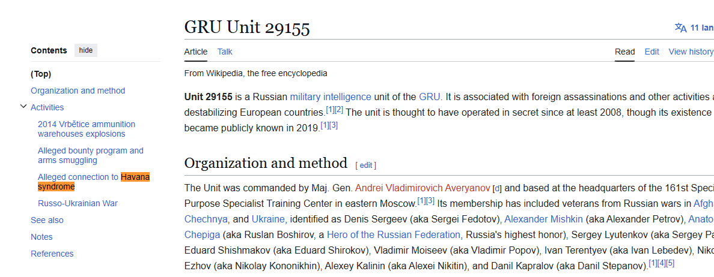

Bắt đầu từ cuối năm 2016, các nhà ngoại giao Hoa Kỳ và Canada làm việc tại Đại sứ quán Hoa Kỳ ở Havana bắt đầu báo cáo về các triệu chứng thần kinh bí ẩn như đau đầu, chóng mặt, suy giảm nhận thức và mất thính lực. Những sự cố này, ban đầu được gọi là 'Hội chứng Havana', sau đó được cộng đồng tình báo Hoa Kỳ phân loại là 'Sự cố Sức khỏe Dị thường' (AHIs). Một cuộc điều tra chung năm 2024 của The Insider, Der Spiegel và 60 Minutes đã liên kết những sự cố này với một đơn vị tình báo quân sự cụ thể của Nga. Hãy xác định số hiệu của đơn vị GRU có liên quan.
flag{NUMBER}

Dẫn chứng: 
https://en.wikipedia.org/wiki/GRU_Unit_29155

flag{29155}