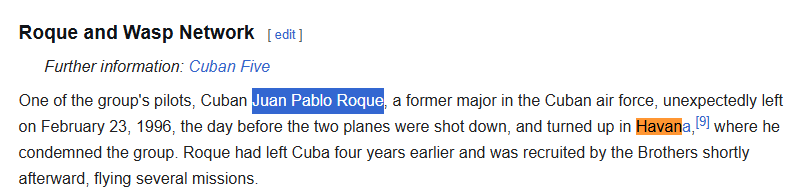

Vào tháng 2 năm 1996, các máy bay MiG của Cuba đã bắn rơi hai máy bay dân sự do tổ chức Brothers to the Rescue (Những người anh em cứu nạn) điều hành trên eo biển Florida, khiến bốn thành viên phi hành đoàn thiệt mạng. Tình báo sau đó tiết lộ rằng một mạng lưới điệp viên Cuba hoạt động ở Miami đã cung cấp thông tin mục tiêu góp phần vào vụ bắn hạ này. Đặc biệt, có một đặc vụ là phi công và cũng là thành viên của Brothers to the Rescue, người đã trực tiếp tuồn thông tin cho tình báo Cuba (DGI). Hắn đã biến mất và trở về Havana đúng một ngày trước khi cuộc tấn công xảy ra. Hãy xác định đặc vụ này bằng họ tên đầy đủ được sử dụng trong các tài liệu của tòa án Hoa Kỳ.
flag{FIRST_MIDDLE_LAST}

Dẫn chứng: https://en.wikipedia.org/wiki/Brothers_to_the_Rescue

flag{JUAN_PABLO_ROQUE}