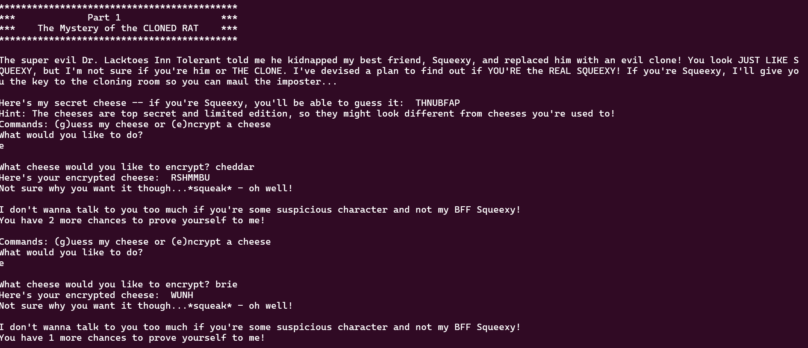
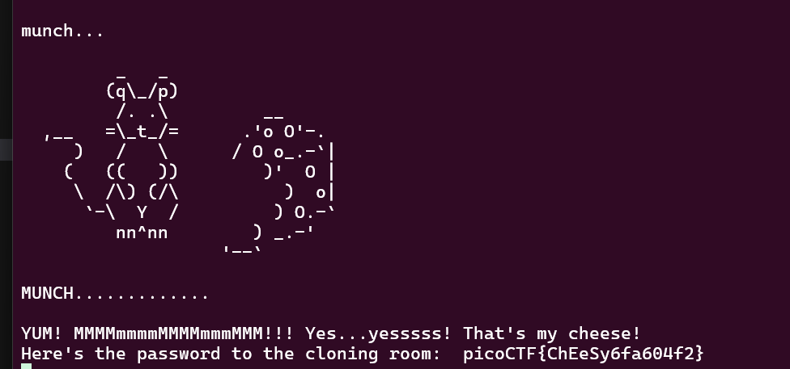

# Guess My Cheese (Part 1)
---
#### Try to decrypt the secret cheese password to prove you're not the imposter! Connect to the program on our server: nc verbal-sleep.picoctf.net 60985
---

Có 2 chức năng guess và encrypt
Ta thử mã hoá 1 loại cheese là cheddar, thì ta nhận được mã hoá

Đọc gợi ý ta có thể thấy rằng bài này dùng mã hoá Affine tuyến tính.
Trong trường hợp này thì mình có A = 21, B = 1 (dùng dcode.fr).
Vậy chỉ cần giải mã phô mai đề bài cho là ta tìm được flag

Bài này khá là may rủi, nhiều khi giải đúng mà bài không trả flag, ta nên thử nhiều lần.