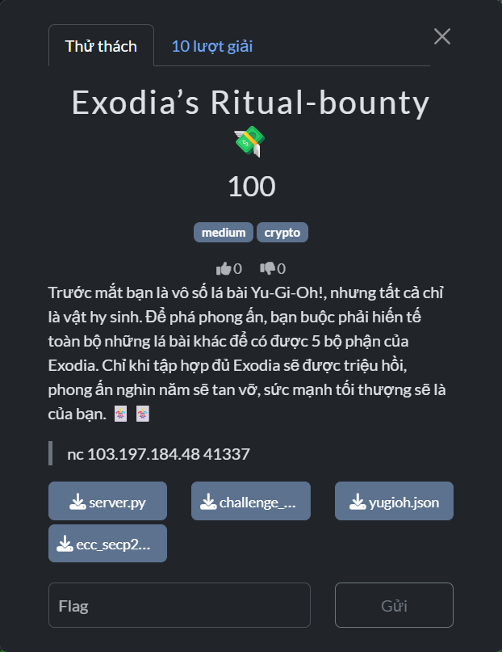

# Exodia’s Ritual-bounty (PTIT CTF 2025)



## Mục tiêu
Ghép **Exodia** bằng cách gửi 5 mảnh hex (≤32B) sao cho **XOR của cả 5 mảnh = private key d** của phiên. Khi đúng, server in `FLAG`.

---

## Phân tích file & cơ chế

### `server.py`
- Service TCP với các lệnh: `help`, `public_key`, `choices`, `vaults`, `unlock_exodia <head> <Larm> <Rarm> <Lleg> <Rleg>`, `quit/exit`.
- Giới hạn **200 lệnh** và **SESSION_TIMEOUT ≈ 180s**.
- `unlock_exodia` gọi `verify_exodia_shards()`: XOR 5 mảnh phải đúng `private_key` → in `FLAG`.

### `challenge_yugivault.py`
- Nạp `yugioh.json`, làm sạch thành các item `{id, name}`, **sort tăng dần theo id/power**.
- `start()`:
  - Chọn ngẫu nhiên 12 lá → `secret_order`.
  - Tạo **private key** `d = sha256(bytes([id & 0xFF for id in ids_secret]))`.
  - `public_key = secp256k1(d)` (compressed).
  - `selected_sorted = sorted(secret_order, key=id)` để hiển thị ra lệnh `choices` (đã **sort**).
  - Tạo 6 `vault`: mỗi vault có `v_id = uuid4()`, hoán vị 12 id để dựng **nonce k**:
    - `_pack_nonce_from_ids_shuffled(ids)`: ghi 12 id (16-bit **little-endian**) vào 32 byte rồi **đảo ngược toàn buffer** ⇒ tương đương `k = 00^8 || (id[11]..id[0])` với **mỗi id ở dạng big-endian 2B**.
    - Ký ECDSA trên `z = sha256(v_id)` → chữ ký **raw** `r||s` (64B, chuẩn hóa **low-s**).

### `ecc_secp256k1.py`
- EC/ECDSA thuần Python: `_scalar_mult`, `_point_add`, `public_key_compressed`, `ecdsa_sign_raw(msg32, d, k_bytes)`.
- Công thức ECDSA:  
  `r = (kG)_x mod n`, `s = k^{-1}(z + r·d) mod n)` với chuẩn hóa low-s.

### `yugioh.json`
- Danh sách thẻ, đủ để chọn 12 thẻ mỗi phiên. `choices` chính là 12 lá của phiên nhưng đã **sort tăng dần**, khác với **thứ tự thực tế** dùng để tạo `k`.

---

## Cách challenge chạy
1. `public_key` → lấy PK nén (tham khảo/đối chiếu).
2. `choices` → 12 id 16-bit đã sort tăng dần.
3. `vaults` → 6 mục `{id, signature}` với `id` là UUID, `signature` = `r||s` (64B hex).
4. `unlock_exodia <5 hex>` → nếu XOR = `d_bytes` thì in `FLAG`.

---

## Lý thuyết

### Từ ECDSA đến d nếu biết k
Với ECDSA trên secp256k1:  
`s ≡ k^{-1}(z + r·d) (mod n)` ⇒ `d ≡ (s·k − z) · r^{-1} (mod n)`.

**Nếu biết k** thì tính d rất đơn giản.

### Vì sao khôi phục được k?
`k` **không ngẫu nhiên**. Nó được dựng từ **đúng 12 id 16-bit** (chính là tập `choices`), chỉ khác **thứ tự**:  
`k_bytes = 00^8 || (id[11]..id[0])` (mỗi id 2B big-endian).

Do đó, bài toán thành: tìm hoán vị của 12 từ 16-bit sao cho `kG` có hoành độ `r` (lấy từ chữ ký).


## Ý tưởng
Hãy tưởng tượng có **12 miếng ghép**, cần sắp vào **12 vị trí** `j = 0..11`.  
Mỗi vị trí có một “độ nặng” tăng dần (vị trí càng lớn càng nặng). Khi bạn đặt một ID vào vị trí `j`, tổng điểm sẽ tăng thêm một phần tương ứng với “độ nặng” của vị trí đó.

Nếu ta cộng **đủ 12 miếng** theo đúng thứ tự, ta sẽ thu được một **điểm** duy nhất trên đường cong — gọi là `k·G`. Chữ ký ECDSA cho ta **hoành độ x** của điểm này, tức là giá trị `r`. Như vậy, ta chỉ cần tìm cách sắp 12 miếng sao cho tổng điểm của chúng **khớp** với một điểm có hoành độ `r` (trên đường cong có đúng **2 điểm** cùng hoành độ, do đối xứng qua trục x).

##  Meet‑in‑the‑Middle
- Chia 12 vị trí thành 2 nửa:
  - **Low**: `j = 0..5` (nhẹ hơn)
  - **High**: `j = 6..11` (nặng hơn)
- Vì thử hết 12! thứ tự là bất khả thi, ta làm **MITM**:
  1) **Nửa High**: thử **mọi cách** chọn và sắp **6 ID** vào các vị trí `6..11`. Với mỗi cách, ta tính tổng điểm của nửa này, gọi là `S_hi`, rồi **lưu vào bảng tra** (hash map).
  2) **Nửa Low**: cũng thử sắp **6 ID còn lại** vào `0..5` để tính `S_lo`.

Từ chữ ký, ta dựng được **2 ứng viên điểm `R`** có hoành độ `r`. Để tổng **đủ 12 miếng** khớp `R`, điều kiện phải là:

```
S_hi  +  S_lo  =  R
⇒ S_hi = R - S_lo
```


## Kết quả sau khi khớp
- Từ cặp `S_lo` và `S_hi` khớp `R`, ta suy ra **thứ tự 12 ID** theo `j = 0..11`.
- Dựa vào thứ tự đó, ghép lại **nonce `k`** (nhớ quy tắc pack: 8 byte 0 ở đầu, rồi **12 ID theo thứ tự ngược** mỗi ID 2 byte big‑endian).
- Có `k` rồi thì tính **`d = (s·k − z) · r^{-1} mod n`** là xong.

## Tóm tắt thao tác
1) Dựng bảng nửa **High**: mọi sắp xếp 6 ID vào `6..11` → lưu `S_hi` vào map.  
2) Duyệt nửa **Low**: mọi sắp xếp 6 ID còn lại vào `0..5` → tính `S_lo`.  
3) Với mỗi `S_lo`, kiểm tra **`S_hi = R − S_lo`** cho **2 ứng viên `R`**.  
4) Khi trúng, ráp lại **thứ tự 12 ID**, ghép **k**, rút **d**, rồi ghép 5 mảnh Exodia để lấy FLAG.


---

## Khai thác từng bước

1. Gọi `choices` lấy 12 id (16-bit) → mảng `words16`.
2. Gọi `vaults`, chọn 1 mục:
   - Parse `signature` (hex 64B) → `r, s` (mỗi 32B big-endian).
   - `z = sha256(vault_id) (mod n)`.
3. MITM để tìm **k**:
   - `Q_j = ((2^16)^j mod n) · G` cho `j=0..11`.
   - Build `high_map` một lần từ `words16` (DFS với bảng “contrib” cho pos 6..11).
   - Với `r`, nâng x → {R_even, R_odd}; duyệt low-half và khớp `S_hi = R − S_lo`.
   - Khi ra **thứ tự 12 từ** theo `j=0..11`, pack `k`: `00^8 || ids[11..0] (2B big)`.
4. Khôi phục **d**: `d = (s·k − z) · r^{-1} (mod n)`.
5. Sinh **5 mảnh Exodia**: random 4 mảnh 32B, mảnh thứ 5 = XOR của `d_bytes` với 4 mảnh kia. Gửi `unlock_exodia ...`.

Lưu ý:
- EC math cần xử lý trường hợp **y = 0** khi doubling: nếu `y==0` thì `2P = O`, tránh `_mod_inv(0, P)`.
- Tối ưu: tiền tính `Q_j` và `high_map` chỉ **một lần**; mỗi vault chỉ chạy phần low + matching.

---

## Script 

<details>
  <summary>Code</summary>

  ```
  # -*- coding: utf-8 -*-
from collections import defaultdict
import socket, json, hashlib, secrets, itertools, sys, re, time
from typing import List, Tuple, Dict, Optional

# secp256k1
P  = 0xFFFFFFFFFFFFFFFFFFFFFFFFFFFFFFFFFFFFFFFFFFFFFFFFFFFFFFFEFFFFFC2F
N  = 0xFFFFFFFFFFFFFFFFFFFFFFFFFFFFFFFEBAAEDCE6AF48A03BBFD25E8CD0364141
A  = 0
Gx = 55066263022277343669578718895168534326250603453777594175500187360389116729240
Gy = 32670510020758816978083085130507043184471273380659243275938904335757337482424
G  = (Gx, Gy)

def _mod_inv(a: int, n: int) -> int:
    if a == 0: raise ZeroDivisionError("inverse of 0")
    lm, hm = 1, 0; low, high = a % n, n
    while low > 1:
        r = high // low
        nm, new = hm - lm*r, high - low*r
        lm, low, hm, high = nm, new, lm, low
    return lm % n

def _point_add(Pt, Qt):
    if Pt is None: return Qt
    if Qt is None: return Pt
    x1, y1 = Pt; x2, y2 = Qt
    if Pt == Qt:
        if y1 % P == 0: return None
        s = ((3*x1*x1 + A) * _mod_inv((2*y1) % P, P)) % P
    else:
        if x1 == x2 and (y1 + y2) % P == 0: return None
        denom = (x2 - x1) % P
        if denom == 0: return None
        s = ((y2 - y1) * _mod_inv(denom, P)) % P
    x3 = (s*s - x1 - x2) % P
    y3 = (s*(x1 - x3) - y1) % P
    return (x3, y3)

def _point_neg(Pt):
    if Pt is None: return None
    x, y = Pt
    return (x, (-y) % P)

def _scalar_mult(k: int, Pt=G):
    if k % N == 0 or Pt is None: return None
    if k < 0: return _scalar_mult(-k, (Pt[0], (-Pt[1]) % P))
    result = None; addend = Pt
    while k:
        if k & 1: result = _point_add(result, addend)
        addend = _point_add(addend, addend)
        k >>= 1
    return result

def sha256i(b: bytes) -> int:
    return int.from_bytes(hashlib.sha256(b).digest(), 'big') % N

def parse_sig_r_s(sig_hex: str) -> Tuple[int,int]:
    sig = bytes.fromhex(sig_hex); assert len(sig) == 64
    return int.from_bytes(sig[:32],'big'), int.from_bytes(sig[32:],'big')

def recover_d_from_k_r_s_z(k: int, r: int, s: int, z: int) -> int:
    rinv = _mod_inv(r % N, N)
    return ((s * (k % N) - (z % N)) % N) * rinv % N

def pubkey_compressed_from_d(d: int) -> bytes:
    Px, Py = _scalar_mult(d, G)
    return (b'\x02' if (Py % 2 == 0) else b'\x03') + Px.to_bytes(32, 'big')

def lift_x_to_points(x: int):
    rhs = (pow(x % P, 3, P) + 7) % P
    y = pow(rhs, (P+1)//4, P)
    if (y*y) % P != rhs: return []
    return [(x % P, y), (x % P, (-y) % P)]

def k_bytes_from_order(words16_by_pos: List[int]) -> bytes:
    tail = b''.join(int(w).to_bytes(2, 'big') for w in words16_by_pos[::-1])
    return b'\x00'*8 + tail

B16 = 1 << 16

def precompute_Qj() -> List[Tuple[int,int]]:
    Q = []; powB = 1
    for _ in range(12):
        Q.append(_scalar_mult(powB % N, G))
        powB = (powB * B16) % N
    return Q

def mul_small_on_point(w: int, Pt: Tuple[int,int]) -> Tuple[int,int]:
    return _scalar_mult(w, Pt)

def build_high_map(words16: List[int], Q: List[Tuple[int,int]]):
    pos_hi = (6, 7, 8, 9, 10, 11)
    n = len(words16)
    contrib = [[mul_small_on_point(words16[i], Q[pos_hi[level]]) for level in range(6)] for i in range(n)]
    high_map = defaultdict(list)
    used = [False]*n
    cur_perm = [0]*6
    def dfs(level, acc_point):
        if level == 6:
            perm = tuple(cur_perm)
            high_map[acc_point].append((perm, frozenset(perm)))
            return
        for i in range(n):
            if not used[i]:
                used[i] = True
                cur_perm[level] = words16[i]
                term = contrib[i][level]
                new_acc = term if acc_point is None else _point_add(acc_point, term)
                dfs(level+1, new_acc)
                used[i] = False
    dfs(0, None)
    return high_map

def find_k_with_mitm_using_map(r: int, words16: List[int], Q: List[Tuple[int,int]], high_map) -> Tuple[Optional[int], Optional[List[int]]]:
    pos_lo = (0, 1, 2, 3, 4, 5); pos_hi = (6, 7, 8, 9, 10, 11)
    Rcands = lift_x_to_points(r % N)
    if not Rcands: return None, None
    words16 = tuple(words16); n = len(words16)
    contrib = [[mul_small_on_point(words16[i], Q[pos_lo[lvl]]) for lvl in range(6)] for i in range(n)]
    used = [False]*n
    cur_perm_lo = [0]*6
    for Rpt in Rcands:
        def dfs(level, acc_point):
            if level == 6:
                set_lo = frozenset(cur_perm_lo)
                target = _point_add(Rpt, _point_neg(acc_point))
                cands = high_map.get(target)
                if not cands: return
                for perm_hi, set_hi in cands:
                    if not set_hi.isdisjoint(set_lo):  # must be disjoint
                        continue
                    by_pos = [None]*12
                    for w,j in zip(cur_perm_lo, pos_lo): by_pos[j] = w
                    for w,j in zip(perm_hi,  pos_hi): by_pos[j] = w
                    k_bytes = k_bytes_from_order(by_pos)
                    k = int.from_bytes(k_bytes, 'big') % N
                    Rchk = _scalar_mult(k, G)
                    if Rchk is None or (Rchk[0] % N) != (r % N):
                        continue
                    raise StopIteration((k, by_pos))
                return
            for i in range(n):
                if not used[i]:
                    used[i] = True
                    cur_perm_lo[level] = words16[i]
                    term = contrib[i][level]
                    new_acc = term if acc_point is None else _point_add(acc_point, term)
                    dfs(level+1, new_acc)
                    used[i] = False
        try:
            dfs(0, None)
        except StopIteration as e:
            return e.value
    return None, None

def make_exodia_shards(d: int) -> List[str]:
    d_bytes = d.to_bytes(32, 'big')
    parts = [secrets.token_bytes(32) for _ in range(4)]
    x = d_bytes
    for p in parts: x = bytes(a ^ b for a,b in zip(x, p))
    parts.append(x)
    return [p.hex() for p in parts]

def recvline(sock) -> str:
    buf = b""
    while not buf.endswith(b"\n"):
        chunk = sock.recv(1)
        if not chunk: break
        buf += chunk
    return buf.decode("utf-8", errors="ignore")

def read_until_prompt(sock):
    out = ""
    while True:
        line = recvline(sock)
        if not line: break
        out += line
        if line.endswith("> ") or line.strip().endswith(">"): break
    return out

def send_cmd(sock, cmd: str) -> str:
    sock.sendall((cmd+"\n").encode())
    return read_until_prompt(sock)

def parse_json_block(block: str):
    m = re.search(r'(\[[\s\S]*\])', block)
    if not m: m = re.search(r'(\{[\s\S]*\})', block)
    if not m: raise ValueError("Không tìm thấy JSON:\n" + block[-500:])
    return json.loads(m.group(1))

def solve(host: str, port: int, verbose: bool = True):
    t0 = time.time()
    with socket.create_connection((host, port), timeout=20) as s:
        _ = read_until_prompt(s)
        if verbose: print("[*] Getting public_key ...")
        pub_out = send_cmd(s, "public_key")
        m = re.search(r'public_key:\s*([0-9a-fA-F]+)', pub_out)
        pub_hex = m.group(1).lower() if m else None
        if verbose and pub_hex: print("[+] pub =", pub_hex)

        if verbose: print("[*] Getting choices ...")
        ch_out = send_cmd(s, "choices")
        choices = parse_json_block(ch_out)
        words16 = [int(c["id"]) & 0xFFFF for c in choices]
        if verbose: print("[+] 12 ids (16-bit) =", words16)

        if verbose: print("[*] Getting vaults ...")
        v_out = send_cmd(s, "vaults")
        vaults = parse_json_block(v_out)
        if verbose: print(f"[+] {len(vaults)} vaults fetched")

        if verbose: print("[*] Precomputing Q_j ...")
        Q = precompute_Qj()
        if verbose: print("[*] Building HIGH map ...")
        high_map = build_high_map(words16, Q)

        d = None
        for idx, v in enumerate(vaults):
            r, s_val = parse_sig_r_s(v["signature"])
            z = sha256i(v["id"].encode("utf-8"))
            if verbose: print(f"[*] Trying vault {idx+1}/{len(vaults)} ...")
            k, order = find_k_with_mitm_using_map(r, words16, Q, high_map)
            if k is None:
                if verbose: print("    [-] no k match")
                continue
            d_try = recover_d_from_k_r_s_z(k, r, s_val, z)
            if pub_hex:
                if pubkey_compressed_from_d(d_try).hex() != pub_hex:
                    if verbose: print("    [-] d mismatch pubkey")
                    continue
            d = d_try
            break

        if d is None:
            print("[-] Không khôi phục được d. Thử lại session mới.")
            return

        shards = make_exodia_shards(d)
        head, Larm, Rarm, Lleg, Rleg = shards
        if verbose: print("[*] Submitting unlock_exodia ...")
        res = send_cmd(s, f"unlock_exodia {head} {Larm} {Rarm} {Lleg} {Rleg}")
        print(res)
        if verbose: print(f"[✓] Done in {time.time()-t0:.2f}s")

if __name__ == "__main__":
    host = sys.argv[1] if len(sys.argv) > 1 else "103.197.184.48"
    port = int(sys.argv[2]) if len(sys.argv) > 2 else 41337
    try:
        solve(host, port, verbose=True)
    except KeyboardInterrupt:
        print("\n[!] Interrupted by user")
  ```
</details>

---

## Flag
`PTITCTF{Exodia_the_forbidden_one_has_been_assembled}`
