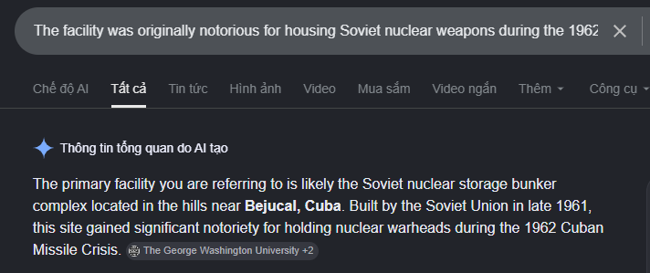

Một đánh giá tình báo địa không gian (GEOINT) đã được giải mật có nhắc đến một cơ sở "nằm ẩn mình trong những ngọn đồi nhìn ra Havana", nơi từ nhiều thập kỷ qua đã bị nghi ngờ có mối liên hệ với tình báo Trung Quốc. Hình ảnh vệ tinh của CSIS (Trung tâm Nghiên cứu Chiến lược và Quốc tế) từ tháng 3 năm 2024 cho thấy cơ sở này vẫn đang hoạt động. Phía nam của căn cứ có ít nhất 5 lối vào các công trình ngầm được xây dựng trong khoảng thời gian từ năm 2010 đến 2019. Cơ sở này ban đầu khét tiếng vì từng là nơi lưu trữ vũ khí hạt nhân của Liên Xô trong Cuộc khủng hoảng tên lửa Cuba năm 1962. Hãy xác định thị trấn nằm gần cơ sở này nhất.

Định dạng đáp án: flag{TỪ_CẦN_TÌM}

flag{BEJUCAL}