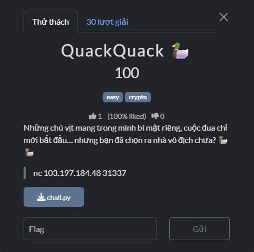

# WRITE-UP PTITCTF FINAL 2025

## QuackQuack

## 1) Mô tả đề



Đầu tiên ta thử nc 103.197.184.48 31337


Ở đây ta phải chọn con vịt từ 1 đến n.


Khi cược thắng sẽ được như trên.

Ta để ý rằng sau mỗi vòng thì sẽ tăng số vịt.

Ta sẽ xem thử source code.

Để ý hàm handle:

```python
def handle(self):
        self.request.settimeout(3.0)
        W, R = self.request.sendall, self.request.recv
        send = lambda s: sendln(W, s)
        recv = lambda   : recvline(R)

        cfg = self.server.cfg
        secret = random.getrandbits(BITS)

        print_banner(send)
        send("Bạn phải chọn lane thắng (1..N) trước khi đua")

        for r in range(1, cfg.rounds+1):
            n     = cfg.ducks_start + (r-1 if cfg.inc else 0)
            seed  = seed_for_round(secret, r)
            commit= sha1_hex(seed) # SHA1 của chuỗi số seed
            ticket= ticket_of(seed) # return (seed * 31337 + 1337) & 0xFFFF

            send(f"Round {r}/{cfg.rounds}")
            send(f"COMMIT: {commit}")
            send(f"TICKET: {ticket}")
            send(f"Hãy nhập chỉ số vịt thắng (1..{n}) trước khi đua: ")
            s = recv()
            if not s.isdigit() or not (1 <= int(s) <= n): send("Input không hợp lệ. Bye."); return
            bet_idx = int(s)-1

            eng, t0 = DuckEngine(seed, n, cfg.track_len), time.time()
            for _ in range(6):
                render_frame(send, eng, cfg.track_len, bet_idx, t0, r, cfg.rounds, commit, ticket); time.sleep(cfg.tick)
            while max(eng.x) < eng.length:
                eng.step_once()
                render_frame(send, eng, cfg.track_len, bet_idx, t0, r, cfg.rounds, commit, ticket); time.sleep(cfg.tick)

            winners = eng.winner_1based_eps()
            send("\nKẾT QUẢ:"); send(f"- Quán quân: lane #{winners[0]}")
            send(f"REVEAL seed = {seed}"); send(f"SHA1(seed) = {sha1_hex(seed)}")
            if (bet_idx+1) not in winners: send("Bạn đoán sai. GG!"); return
            if r < cfg.rounds: send("Đúng! Vào round tiếp theo...\n"); time.sleep(0.6)

        send(f"Tuyệt vời! Bạn đã đoán đúng tất cả {cfg.rounds} round."); send(f"FLAG: {FLAG}")
```

Nếu chúng ta đoán được hết 30 vòng con vịt chiến thắng thì sẽ ra flag.

Mỗi vòng ta được cho `seed`, `commit`, `ticket`, ta phải dựa vào đó để đoán được con vịt sẽ chiến thắng.

---

## 2) `TICKET` - `COMMIT` - `SEED`

- Những gì ta biết:
    - `COMMIT = SHA1(str(seed))`
    - `TICKET = (seed*31337 + 1337) mod 2^16`
- Vì $gcd(31337,2^{16})=1$ (31337 lẻ), tồn tại nghịch đảo
    
    Suy ra:
    
    $seed≡(ticket−1337)⋅31337^{−1}\ (mod\ 2^{16}).$
    
- Seed chỉ **20-bit** → các nghiệm hợp lệ:
    
    $\text{seed} \in \{ b + k\cdot 2^{16} \mid k=0..15 \},$
    
    Với $b = ((\text{ticket}-1337)\cdot 31337^{-1}) \bmod 2^{16}$.
    
- Dò 16 ứng viên, chọn cái có `SHA1(str(seed)) == COMMIT` → **seed chính xác**.

---

## 3) Lý thuyết áp dụng

- **Modular inverse**: nếu $gcd(a,m)=1$ thì tồn tại $a^{-1}\pmod{m}$. Ở đây $a=31337,\ m=2^{16}$.
- **Leak tuyến tính modulo nhỏ**: công khai phép chiếu modulo nhỏ của bí mật có độ dài bé (20-bit) làm giảm không gian tìm kiếm xuống số lượng nhỏ các coset (16 ứng viên).
- **Cam kết bằng hash**: `COMMIT` đóng vai trò xác thực: tìm ứng viên seed sao cho SHA-1 khớp → chọn đúng seed.

---

## 4) Mô phỏng cuộc đua (tại sao dự đoán được lane thắng?)

- `DuckEngine` dùng `random.Random(seed)` nên mọi thứ **lặp lại y hệt** nếu `seed` giống nhau. Cùng một `seed` → cùng một chuỗi ‘ngẫu nhiên’ → cuộc đua sẽ chạy **đúng cùng kịch bản** mỗi lần.”
- Tạo:
    - `wind_bias`, `wind_puff` (random theo seed).
    - Mỗi lane có `FancyTrack` riêng (được seed bởi `derive_int("track", seed, lane, length)`) tạo tile: Boost/Mud/Oil/Normal.
- Mỗi tick: vịt tăng bước theo phân phối `choice` + ảnh hưởng gió + địa hình + xác suất trượt (`slip_p`) + “sprint” (cooldown).
- Kết thúc: chọn lane có $x_i-(L+\varepsilon_i)$ lớn nhất.
    
    ```python
    def winner_1based_eps(self):
            best_i, best_s = 0, -1e99
            for i in range(self.n):
                s = self.x[i] - (self.length + self.finish_eps[i])
                if s > best_s:
                    best_s, best_i = s, i
            return best_i + 1
    ```
    
    → Tất cả phụ thuộc **duy nhất** vào `seed` ⇒ mô phỏng là biết trước người thắng.
    

---

## 5) Khai thác

1. Nhận `COMMIT`, `TICKET`.
2. Từ `TICKET` khôi phục 16 ứng viên `seed` (20-bit) → kiểm `COMMIT` để lấy **seed** đúng.
3. Mô phỏng `DuckEngine(seed, n, length)` để biết **lane thắng**.
4. Gửi lane trước khi đua bắt đầu.
5. Lặp lại đến hết rounds → in FLAG.

---

## 6) Script

- Code
    
    ```python
    #!/usr/bin/env python3
    # -*- coding: utf-8 -*-
    
    import socket
    import re
    import hashlib
    import random
    
    HOST = "103.197.184.48"
    PORT = 31337
    
    ROUNDS_TOTAL = 30
    DUCKS_START  = 3
    INC          = True
    
    BITS = 20
    MOD16 = 1 << 16
    TRACK_LEN_DEFAULT = 60
    
    def sha1_hex(x: int) -> str:
        return hashlib.sha1(str(x).encode()).hexdigest()
    
    def derive_int(*parts, bits=64):
        h = hashlib.sha1()
        for p in parts:
            h.update(str(p).encode()); h.update(b"|")
        return int.from_bytes(h.digest(), "big") & ((1 << bits) - 1)
    
    TILE_NORMAL, TILE_BOOST, TILE_MUD, TILE_OIL = ".", "B", "M", "O"
    
    class FancyTrack:
        def __init__(self, seed, lane, length):
            rng = random.Random(derive_int("track", seed, lane, length, bits=64))
            self.tiles = []
            for _ in range(length):
                r = rng.random()
                self.tiles.append(
                    TILE_BOOST if r < 0.06 else
                    TILE_MUD   if r < 0.11 else
                    TILE_OIL   if r < 0.16 else
                    TILE_NORMAL
                )
        def at(self, x, length):
            return self.tiles[x] if 0 <= x < length else TILE_NORMAL
    
    class DuckEngine:
        def __init__(self, seed, n, length=TRACK_LEN_DEFAULT):
            self.rng = random.Random(seed)
            self.n, self.length = n, length
            self.x   = [0]*n
            self.cd  = [0]*n
            self.trk = [FancyTrack(seed, i, length) for i in range(n)]
            self.wind_bias = self.rng.random()*0.08
            self.wind_puff = self.rng.random()*0.05
            self.finish_eps = [
                (derive_int("finish_eps", seed, i, length, bits=64)/float(1<<64))*1e-6 + i*1e-9
                for i in range(n)
            ]
    
        def step_once(self):
            prev = self.x[:]
            for i in range(self.n):
                prog = self.x[i]/max(1, self.length)
                step = self.rng.choice([0,1,1,1,2] if prog < 0.7 else [0,1,1,1,1,2])
                if self.rng.random() < self.wind_bias: step += 1
                if self.rng.random() < self.wind_puff: step += 1
                if any(px - prev[i] in (1,2) for j, px in enumerate(prev) if j != i): step += 1
                tentative = min(self.length, self.x[i] + step)
                tile = self.trk[i].at(tentative, self.length)
                slip_p = 0.05 + (0.10 if tile == TILE_OIL else 0.0)
                if tile == TILE_BOOST: step += 1
                elif tile == TILE_MUD: step = max(0, step-1)
                if self.rng.random() < slip_p:
                    self.x[i] = max(0, self.x[i]-1)
                    if self.cd[i] > 0: self.cd[i] -= 1
                    continue
                if self.cd[i] <= 0 and self.rng.random() < 0.08:
                    step += 2
                    self.cd[i] = self.rng.randint(10,16)
                self.x[i] = min(self.length, self.x[i] + step)
                if self.cd[i] > 0: self.cd[i] -= 1
    
        def winner_1based_eps(self):
            best_i, best_s = 0, -1e99
            for i in range(self.n):
                s = self.x[i] - (self.length + self.finish_eps[i])
                if s > best_s:
                    best_s, best_i = s, i
            return best_i + 1
    
    def find_seed_from_commit_ticket(commit_hex, ticket):
        inv = pow(31337, -1, MOD16)
        base = ((ticket - 1337) * inv) % MOD16
        for k in range(1 << (BITS - 16)):
            s = (base + k * MOD16) & ((1 << BITS) - 1)
            if sha1_hex(s) == commit_hex:
                return s
        return None
    
    def compute_winner(seed, n, track_len=TRACK_LEN_DEFAULT):
        eng = DuckEngine(seed, n, track_len)
        while max(eng.x) < eng.length:
            eng.step_once()
        return eng.winner_1based_eps()
    
    ANSI_RE = re.compile(r"\x1b\[[0-9;]*[A-Za-z]")
    def strip_ansi(b: bytes) -> str:
        return ANSI_RE.sub("", b.decode("utf-8", errors="ignore"))
    
    def recv_until_commit_ticket(sock):
        buf = ""
        while True:
            chunk = sock.recv(4096)
            if not chunk:
                raise RuntimeError("connection closed")
            buf += strip_ansi(chunk)
            if "Input không hợp lệ" in buf or "GG!" in buf or "FLAG:" in buf:
                return buf, None, None
            m1 = re.search(r"COMMIT:\s*([0-9a-f]{40})", buf)
            m2 = re.search(r"TICKET:\s*(\d+)", buf)
            if m1 and m2:
                return buf, m1.group(1), int(m2.group(1))
    
    def recv_until_next_round_or_end(sock):
        buf = ""
        while True:
            chunk = sock.recv(4096)
            if not chunk:
                break
            buf += strip_ansi(chunk)
            if "Round " in buf or "FLAG:" in buf or "GG!" in buf or "Input không hợp lệ" in buf:
                break
        return buf
    
    def main():
        s = socket.socket()
        s.settimeout(90)
        s.connect((HOST, PORT))
        r = 1
        while True:
            text, commit, ticket = recv_until_commit_ticket(s)
            print(text, end="")
            if commit is None:
                break
            n = DUCKS_START + (r-1 if INC else 0)
            seed = find_seed_from_commit_ticket(commit, ticket)
            if seed is None:
                raise RuntimeError("Seed not found from commit+ticket")
            win = compute_winner(seed, n)
            print(f"[round {r}] commit={commit[:8]} ticket={ticket} -> seed={seed} → bet lane {win}")
            s.sendall((str(win) + "\n").encode())
            out = recv_until_next_round_or_end(s)
            print(out, end="")
            if "FLAG:" in out or "GG!" in out or "Input không hợp lệ" in out:
                break
            r += 1
            if ROUNDS_TOTAL and r > ROUNDS_TOTAL + 2:
                break
    
    if __name__ == "__main__":
        main()
    
    ```
    

---

## 7) Flag

`PTITCTF{predict_the_quacker_y0u_crypto_duckmaster!}`