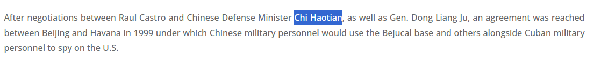

Nguồn gốc về sự hiện diện tình báo của Trung Quốc tại Cuba bắt nguồn từ một chuyến thăm mang tính bước ngoặt vào năm 1999 của một quan chức quân sự cấp cao Trung Quốc. Theo CSIS (Trung tâm Nghiên cứu Chiến lược và Quốc tế) và các báo cáo truyền thông cùng thời, vị quan chức này - Bộ trưởng Bộ Quốc phòng Trung Quốc - đã dẫn đầu một phái đoàn quân sự đến Havana và được cho là đã đạt được thỏa thuận quyền tiếp cận vào một số cơ sở nghe lén điện tử cũ của Liên Xô trên đảo. Một báo cáo bị rò rỉ của FCC (Ủy ban Truyền thông Liên bang Mỹ) từ cùng thời kỳ cho thấy Trung Quốc cũng đã cung cấp cho Cuba các thiết bị gây nhiễu tín hiệu được nâng cấp nhằm can thiệp vào các chương trình phát sóng của Mỹ như Radio Martí. Hãy xác định danh tính vị bộ trưởng quốc phòng Trung Quốc này bằng tên đầy đủ của ông.
Định dạng ví dụ: flag{FIRST_LAST}

Dẫn chứng: https://cubacenter.org/cuba-brief/2025/05/06/cubabrief-beijings-air-space-and-maritime-surveillance-from-cuba-a-growing-threat-to-the-homeland-a-look-back-at-sino-cuba-relations-and-covid/

