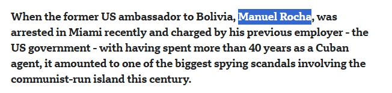

Vào tháng 12 năm 2023, một cựu đại sứ Hoa Kỳ đã bị bắt và bị buộc tội gián điệp sau khi bị cáo buộc hoạt động với tư cách là một điệp viên tình báo của Cuba trong hơn 15 năm. Theo Bộ trưởng Tư pháp Merrick Garland, vụ án này là "một trong những vụ xâm nhập ở cấp cao nhất và kéo dài nhất vào chính phủ Hoa Kỳ bởi một điệp viên nước ngoài." Báo cáo của CSIS lưu ý rằng vụ bắt giữ này "bổ sung vào lịch sử lâu dài của các chiến dịch mà Cuba thực hiện nhằm gài gắm mạng lưới tình báo bên trong các cơ quan của Hoa Kỳ" và làm dấy lên lo ngại rằng Cuba có thể đang chia sẻ các thông tin tình báo thu thập được với Trung Quốc và Nga. Hãy xác định danh tính cựu đại sứ này bằng họ tên đầy đủ.  Ví dụ định dạng: flag{FIRST_LAST}

Dẫn chứng: https://www.bbc.com/news/world-latin-america-67913465

flag{MANUEL_ROCHA}