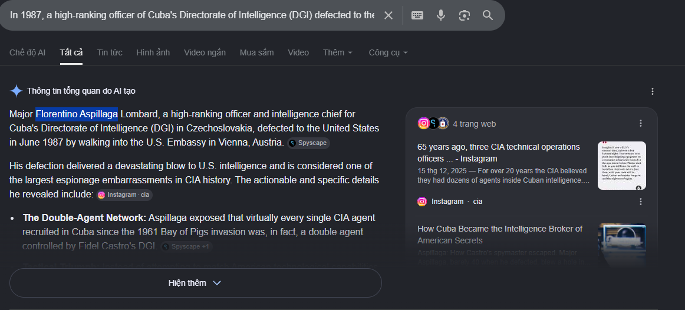

Vào năm 1987, một sĩ quan cấp cao thuộc Tổng cục Tình báo Cuba (DGI) đã đào tẩu sang Hoa Kỳ và cung cấp cho CIA những thông tin tình báo quan trọng về các mạng lưới gián điệp Cuba đang hoạt động trên đất Mỹ. Thông tin của ông đã dẫn đến việc vạch trần nhiều điệp viên Cuba hoạt động dưới vỏ bọc ngoại giao. Cuộc đào tẩu này vẫn là một trong những sự kiện quan trọng nhất trong lịch sử các hoạt động tình báo giữa Mỹ và Cuba. Hãy xác định tên đầy đủ của người đào tẩu này.

Search câu đầu tiên ra đáp án.

flag{FLORENTINO_ASPILLAGA}
