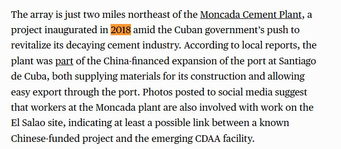

Phân tích của CSIS tiết lộ một mối liên hệ tiềm ẩn giữa một dự án công nghiệp do Trung Quốc tài trợ đã biết gần Santiago de Cuba và cơ sở CDAA (Hệ thống ăng-ten định hướng dạng vòng) mới đang được xây dựng gần đó. Những bức ảnh đăng trên mạng xã hội cho thấy các công nhân từ một nhà máy cụ thể do Trung Quốc tài trợ cũng tham gia vào công việc tại công trường xây dựng SIGINT (Tình báo Tín hiệu) này. Nhà máy này được khánh thành vào năm 2018 như một phần trong nỗ lực của Cuba nhằm hồi sinh cơ sở hạ tầng đang xuống cấp của mình. Loại nhà máy công nghiệp nào kết nối dự án cơ sở hạ tầng của Trung Quốc với công trình xây dựng CDAA?

A. Một nhà máy luyện niken do CNPC tài trợ.

B. Một nhà máy xi măng được xây dựng như một phần của dự án mở rộng cảng do Trung Quốc tài trợ tại Santiago de Cuba.

C. Một nhà máy sản xuất thiết bị viễn thông của Huawei.

D. Một cơ sở sản xuất cáp quang của ZTE.

Dẫn chứng: https://www.csis.org/analysis/chinas-intelligence-footprint-cuba-new-evidence-and-implications-us-security

