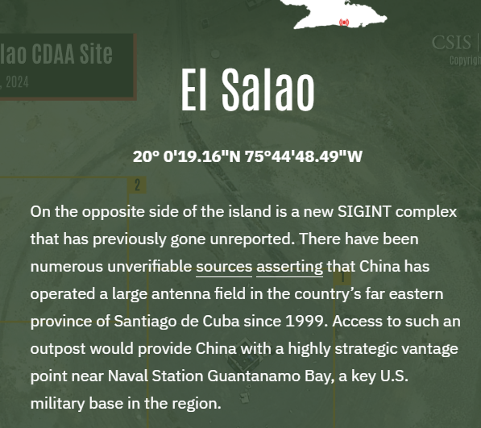
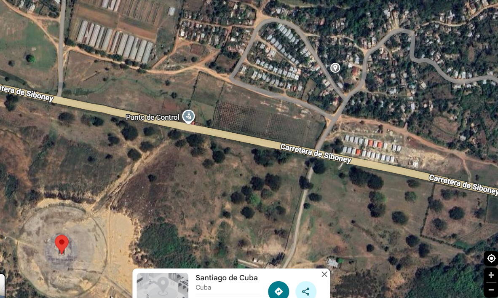

Các nhà nghiên cứu thuộc Trung tâm Nghiên cứu Chiến lược và Quốc tế (CSIS) đã xác định được một cơ sở tình báo tín hiệu (SIGINT) chưa từng được báo cáo trước đây ở phía đông đảo Cuba. Hình ảnh vệ tinh từ tháng 3 năm 2024 cho thấy gần thành phố Santiago de Cuba, một mảng ăng-ten vòng lớn (CDAA) đã được xây dựng từ năm 2021. Với đường kính dự kiến từ 130 đến 200 mét, cơ sở này có khả năng phát hiện các tín hiệu cách xa tới 8.000 hải lý sau khi đi vào hoạt động. Cơ sở này nằm gần một khu phố cụ thể. Hãy gọi tên khu phố này.
Định dạng đáp án: flag{WORD_DE_WORD}

Dẫn chứng: https://features.csis.org/hiddenreach/china-cuba-spy-sigint/

Toạ độ: 20° 0'19.16"N 75°44'48.49"W, hướng về phía đông bắc.

flag{POBLADO_DE_SEVILLA}