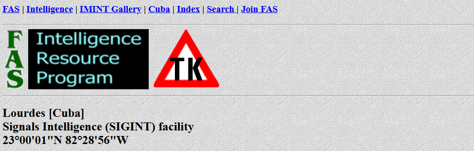
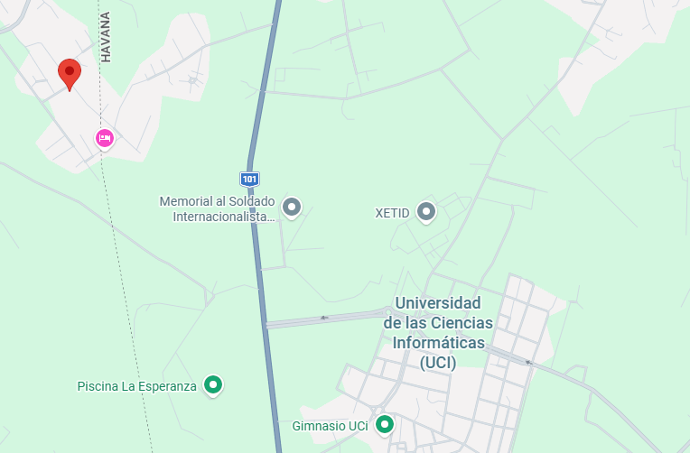

Trong thời kỳ Chiến tranh Lạnh, Liên Xô đã vận hành cơ sở tình báo tín hiệu (SIGINT) hải ngoại lớn nhất của mình gần Havana. Vào thời kỳ đỉnh cao, các quan chức tình báo Mỹ từng làm chứng rằng cơ sở này đã cung cấp cho Liên Xô tới 75% lượng tình báo quân sự về Hoa Kỳ. Cơ sở này đã chính thức đóng cửa vào năm 2002 sau khi Moscow rút quân. Cuba đã tái sử dụng khuôn viên rộng lớn này thay vì để nó lụi tàn. Hiện nay địa điểm này được sử dụng làm gì?

A. Một trung tâm chỉ huy quân sự của Cuba

B. Một trạm giám sát tín hiệu chung giữa Nga và Trung Quốc

C. Một trường đại học quốc gia chuyên về khoa học máy tính và kỹ thuật phần mềm

D. Một tàn tích bị bỏ hoang thời Chiến tranh Lạnh không còn được sử dụng

Ta search cụm câu Liên Xô đã vận hành cơ sở tình báo tín hiệu (SIGINT) hải ngoại lớn nhất của mình gần Havana ra được trang web https://irp.fas.org/imint/c80_04.htm.
Tại đây ta đọc được thông tin đó là căn cứ Lourdes [Cuba] Signals Intelligence (SIGINT) facility 23°00'01"N 82°28'56"W.

Tìm toạ độ thì ta thấy đó là Trường Đại học Khoa học Tin học (Universidad de las Ciencias Informáticas - UCI).

Vậy đáp án là C.